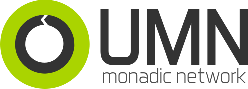

# UMN: Monadic Network

Well, basically, UMN is a networking protocol aimed at providing an easy way to distribute data accross multiple heterogeneous platform, such as in robotics platforms. Technically speaking, UMN abstracts the low-level comm layer (IP, Serial, you name it...) and build an overlay network with dynamic load balancing and distributed autonomous routing between nodes. It also builds a CCN (content centric network) on top of this autonomously routed overlay network. Or so it should... It's in early development :)
